# ROMA Debug

**AI-Powered Multi-Language Debugger with Deep Root Cause Analysis**

[](https://opensource.org/licenses/MIT)
[](https://www.python.org/downloads/)
[](https://ai.google.dev/)

ROMA Debug analyzes error tracebacks across **6 programming languages**, extracts intelligent context using tree-sitter and AST parsing, traces imports and call chains to find **root causes**, and generates targeted code fixes with Gemini.

## Why ROMA?

Most AI debugging tools just paste your error into an LLM. ROMA is different:

| Feature | Generic AI | ROMA Debug |
|---------|-----------|------------|
| Language Support | Python only | Python, JavaScript, TypeScript, Go, Rust, Java |
| Context Extraction | None | AST/tree-sitter parsed function/class boundaries |
| Root Cause Analysis | None | Import tracing + call chain analysis |
| Output Format | Freeform text | Structured JSON with filepath + code |
| Fix Application | Manual copy-paste | Interactive diff + one-key apply |
| Multi-File Fixes | Single file | Root cause + additional fixes across files |
| Backup Safety | None | Automatic `.bak` before patching |

## Features

### Multi-Language Support

ROMA uses **tree-sitter** for semantic parsing across languages:

- **Python** - Native AST + tree-sitter
- **JavaScript/TypeScript** - Full ES6+ and TSX support
- **Go** - Functions, methods, and imports
- **Rust** - Functions, structs, impl blocks
- **Java** - Classes, methods, constructors

### Deep Debugging Mode (V2)

The `--deep` flag enables advanced root cause analysis:

```
┌─────────────────────────────────────────────────────────────┐
│  Error in utils.py:15                                       │
│       ↑                                                     │
│  Called from main.py:42 → process_data()                    │
│       ↑                                                     │
│  Variable passed from api.py:28 → fetch_items()             │
│       ↑                                                     │
│  ROOT CAUSE: api.py returns wrong type                      │
└─────────────────────────────────────────────────────────────┘
```

- **Import Resolution** - Traces imports to find related files
- **Dependency Graph** - Maps file relationships
- **Call Chain Analysis** - Follows execution flow through traceback
- **Upstream Context** - Provides AI with caller/callee information

### Deep Project Awareness (NEW)

ROMA doesn't just analyze tracebacks—it understands your entire project:

```
$ roma --deep
Project: flask
Frameworks: flask
Entry Points: app.py

Error: "Cannot GET /index.html"

Error type: http (http_404)
Relevant Files: app.py, routes.py

╭── Analysis Result ──────────────────────────────────────────╮
│ File: app.py                                                │
│ ...                                                         │
╰─────────────────────────────────────────────────────────────╯
```

Even without explicit tracebacks, ROMA can:

- **Scan Project Structure** - Identifies project type (Flask, Express, Go, etc.)
- **Detect Frameworks** - Recognizes Flask, FastAPI, Django, Express, React, etc.
- **Find Entry Points** - Locates main.py, app.py, server.js, etc.
- **Analyze Error Messages** - Extracts routes, keywords, and error categories
- **Find Relevant Files** - Discovers files related to the error without file paths
- **Provide Context** - Gives AI full project understanding for accurate fixes

## Architecture

```mermaid
flowchart LR
    A[CLI / Web UI] --> B[Project Scanner]
    B --> C[Error Analyzer]
    C --> D[Traceback Parser]
    D --> E{Language Detection}
    E --> F[Tree-sitter Parser]
    E --> G[Python AST Parser]
    F --> H[Context Builder]
    G --> H
    H --> I[Import Resolver]
    I --> J[Dependency Graph]
    J --> K[Call Chain Analyzer]
    K --> L[Gemini API]
    L --> M[JSON Response]
    M --> N{Has Root Cause?}
    N -->|Yes| O[Multi-File Fixes]
    N -->|No| P[Single Fix]
    O --> Q[Diff Engine]
    P --> Q
    Q --> R[User Prompt]
    R --> S[Backup + Patch]
```



**Key Components:**
- **Project Scanner** - Scans project structure, detects frameworks and entry points
- **Error Analyzer** - Analyzes error messages to find relevant files (even without tracebacks)
- **Traceback Parser** - Parses multi-language stack traces
- **Context Builder** - Orchestrates all analysis to build comprehensive AI context

## Quick Start

### Installation

```bash
git clone https://github.com/your-org/ROMA.git
cd ROMA
pip install -e .
```

This installs all dependencies including tree-sitter language parsers.

### Set API Key

```bash
# Option 1: Environment variable
export GEMINI_API_KEY=your-api-key

# Option 2: .env file (recommended)
echo "GEMINI_API_KEY=your-api-key" > .env
```

Get your API key from [Google AI Studio](https://aistudio.google.com/apikey).

### Run

```bash
roma              # Basic mode
roma --deep       # Deep debugging with root cause analysis
```

## Usage

### Interactive Mode

```bash
$ roma

╭─────────────────────────────────────────────╮
│ ROMA Debug - AI-Powered Code Debugger       │
│ Version 0.1.0 | Powered by Gemini           │
╰─────────────────────────────────────────────╯

Paste your error log below.
Press Enter twice (empty line) when done:

Traceback (most recent call last):
  File "src/main.py", line 42, in process_data
    return items[index]
IndexError: list index out of range

Found context from 1 file(s)
Primary: src/main.py (function: process_data)

╭── Analysis Result ──────────────────────────╮
│ File: src/main.py                           │
│ Model: gemini-2.5-flash-lite                │
│                                             │
│ Explanation:                                │
│ Added bounds checking before list access    │
╰─────────────────────────────────────────────╯

Apply this fix to 'src/main.py'? [Y/n]: y
Success! Fixed: src/main.py
```

### Deep Debugging Mode

```bash
$ roma --deep

╭─────────────────────────────────────────────╮
│ ROMA Debug - AI-Powered Code Debugger       │
╰─────────────────────────────────────────────╯

Deep Debugging Mode Enabled
Analyzing imports and call chains for root cause analysis

Paste your error log below:

Traceback (most recent call last):
  File "src/main.py", line 10, in <module>
    run()
  File "src/main.py", line 6, in run
    result = process_data(data)
  File "src/utils.py", line 5, in process_data
    total += item.value
AttributeError: 'int' object has no attribute 'value'

Found context from 3 file(s)
Analyzed 2 upstream file(s)

╭── Analysis Result ──────────────────────────╮
│ File: src/utils.py                          │
│ Model: gemini-2.5-flash-lite                │
│                                             │
│ Explanation:                                │
│ The function expects objects with .value    │
│ but receives plain integers from main.py    │
╰─────────────────────────────────────────────╯

╭── Root Cause Analysis ──────────────────────╮
│ Root Cause File: src/main.py                │
│                                             │
│ Root Cause:                                 │
│ main.py passes raw integers instead of      │
│ Item objects to process_data()              │
╰─────────────────────────────────────────────╯

Additional Files to Fix:
  • src/main.py: Wrap integers in Item objects
```

### Multi-Language Examples

**JavaScript/Node.js:**
```bash
$ roma --language javascript error.log

# Parses stack traces like:
# TypeError: Cannot read property 'name' of undefined
#     at processUser (/app/src/users.js:42:15)
#     at async main (/app/src/index.js:10:5)
```

**Go:**
```bash
$ roma --language go panic.log

# Parses panic traces like:
# panic: runtime error: index out of range [5] with length 3
# goroutine 1 [running]:
# main.processData(...)
#     /app/main.go:25 +0x1f
```

**Rust:**
```bash
$ roma --language rust error.log

# Parses panic traces like:
# thread 'main' panicked at 'index out of bounds'
#     src/main.rs:15:10
```

### Direct File Analysis

```bash
roma error.log                    # Analyze from file
roma --deep error.log             # Deep analysis from file
roma --language go panic.log      # Specify language hint
roma --no-apply error.log         # Show fix without applying
```

### Web API Server

```bash
# Start API server
roma --serve --port 8080

# API docs at http://localhost:8080/docs
```

## CLI Commands

| Command | Description |
|---------|-------------|
| `roma` | Interactive mode - paste errors, get fixes |
| `roma --deep` | Deep debugging with root cause analysis |
| `roma --language <lang>` | Specify language (python, javascript, typescript, go, rust, java) |
| `roma <file>` | Analyze error log from file |
| `roma --serve` | Start web API server (default: port 8080) |
| `roma --no-apply <file>` | Show fix without applying |
| `roma --version` | Show version |

## How It Works

### 1. Multi-Language Traceback Parsing

ROMA auto-detects the language from traceback patterns:

| Language | Pattern Example |
|----------|-----------------|
| Python | `File "path.py", line 10, in func` |
| JavaScript | `at func (/path/file.js:10:5)` |
| TypeScript | `at func (/path/file.ts:10:5)` |
| Go | `main.go:25 +0x1f` |
| Rust | `panicked at 'msg', src/main.rs:15:10` |
| Java | `at com.example.Class.method(File.java:10)` |

### 2. Semantic Code Parsing

ROMA uses **tree-sitter** for multi-language parsing and Python's **ast** module for Python:

```javascript
// Error at line 15 in processUser()
// ROMA extracts the ENTIRE function using tree-sitter

function processUser(user) {     // Line 10
    const name = user.name;
    const email = user.email;
    return formatUser(name, email);  // Line 15 - ERROR
}
```

### 3. Deep Debugging (V2)

When `--deep` is enabled, ROMA:

1. **Parses the full traceback** - Extracts all frames
2. **Resolves imports** - Finds related source files
3. **Builds dependency graph** - Maps file relationships
4. **Analyzes call chain** - Traces execution flow
5. **Provides upstream context** - Gives AI the full picture

### 4. Structured AI Response

ROMA instructs Gemini to return machine-readable JSON:

**V1 Response:**
```json
{
  "filepath": "src/utils.py",
  "full_code_block": "def process_data(items):\n    ...",
  "explanation": "Added type checking for items."
}
```

**V2 Response (Deep Mode):**
```json
{
  "filepath": "src/utils.py",
  "full_code_block": "def process_data(items):\n    ...",
  "explanation": "Added type checking for items.",
  "root_cause_file": "src/main.py",
  "root_cause_explanation": "main.py passes wrong type to process_data()",
  "additional_fixes": [
    {
      "filepath": "src/main.py",
      "full_code_block": "...",
      "explanation": "Convert integers to Item objects"
    }
  ]
}
```

## Project Structure

```
ROMA/
├── setup.py                    # Package configuration
├── .env                        # API key (gitignored)
├── roma_debug/                 # Main package
│   ├── __init__.py
│   ├── config.py               # Centralized configuration
│   ├── main.py                 # Interactive CLI
│   ├── server.py               # FastAPI backend (V1 + V2 endpoints)
│   ├── prompts.py              # System prompts
│   ├── core/
│   │   ├── engine.py           # Gemini integration
│   │   └── models.py           # Data models (Language, Symbol, Import, etc.)
│   ├── parsers/
│   │   ├── base.py             # Abstract parser interface
│   │   ├── registry.py         # Parser registry and language detection
│   │   ├── python_ast_parser.py    # Python AST parser
│   │   ├── treesitter_parser.py    # Multi-language tree-sitter parser
│   │   └── traceback_patterns.py   # Multi-language traceback parsing
│   ├── tracing/
│   │   ├── import_resolver.py  # Import resolution (Python, JS, Go)
│   │   ├── dependency_graph.py # File dependency tracking
│   │   ├── call_chain.py       # Call chain analysis
│   │   └── context_builder.py  # Deep context orchestration
│   └── utils/
│       └── context.py          # Context extraction utilities
├── frontend/                   # React + Vite + Tailwind
└── tests/                      # pytest tests (99 tests)
    ├── test_parsers.py         # Parser tests (including tree-sitter)
    ├── test_traceback_patterns.py  # Multi-language traceback tests
    ├── test_tracing.py         # Import/dependency/call chain tests
    ├── test_context.py         # Context extraction tests
    └── test_engine.py          # Engine tests
```

## API Reference

### POST /analyze (V1)

Basic analysis endpoint.

```bash
curl -X POST http://localhost:8080/analyze \
  -H "Content-Type: application/json" \
  -d '{"log": "Traceback...", "context": ""}'
```

Response:
```json
{
  "explanation": "Added bounds checking.",
  "code": "def process_data(items, index):\n    ...",
  "filepath": "src/main.py"
}
```

### POST /analyze/v2 (V2 - Deep Debugging)

Advanced analysis with root cause detection.

```bash
curl -X POST http://localhost:8080/analyze/v2 \
  -H "Content-Type: application/json" \
  -d '{
    "log": "Traceback...",
    "project_root": "/path/to/project",
    "language": "python",
    "include_upstream": true
  }'
```

Response:
```json
{
  "explanation": "Added type checking.",
  "code": "def process_data(items):\n    ...",
  "filepath": "src/utils.py",
  "root_cause_file": "src/main.py",
  "root_cause_explanation": "Passes wrong type",
  "additional_fixes": [...],
  "model_used": "gemini-2.5-flash-lite"
}
```

### GET /info

Get API capabilities and supported languages.

```bash
curl http://localhost:8080/info
```

Response:
```json
{
  "version": "0.1.0",
  "api_version": "v2",
  "capabilities": {
    "multi_language": true,
    "deep_debugging": true,
    "root_cause_analysis": true,
    "multiple_fixes": true
  },
  "supported_languages": ["python", "javascript", "go", "rust", "java"]
}
```

### GET /health

```bash
curl http://localhost:8080/health
```

## Configuration

| Variable | Description | Required |
|----------|-------------|----------|
| `GEMINI_API_KEY` | Google AI API key | Yes |

## Models

ROMA uses these Gemini models with automatic fallback:

1. **gemini-2.5-flash-lite** (Primary) - Faster, higher quota
2. **gemini-2.5-flash** (Fallback) - Used if primary quota exceeded

## Development

```bash
# Install in editable mode with all dependencies
pip install -e .

# Run tests (99 tests)
pytest

# Run specific test file
pytest tests/test_parsers.py -v

# Start backend server
roma --serve

# Start frontend dev server (separate terminal)
cd frontend && npm run dev
```

## License

MIT License - see [LICENSE](LICENSE) for details.

---

Built for the hackathon. Powered by [Gemini](https://ai.google.dev/) and [tree-sitter](https://tree-sitter.github.io/).
