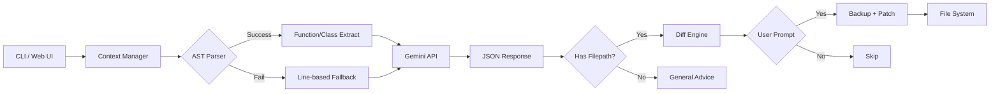

# ROMA Debug

**AI-Powered Code Debugger with Context-Aware Auto-Fix**

[](https://opensource.org/licenses/MIT)
[](https://www.python.org/downloads/)
[](https://ai.google.dev/)

ROMA Debug analyzes Python tracebacks, extracts intelligent context using AST parsing, and generates targeted code fixes with Gemini. It's not a wrapper—it's a **context-aware patching engine** that understands your code structure.

## Why ROMA?

Most AI debugging tools just paste your error into an LLM. ROMA is different:

| Feature | Generic AI | ROMA Debug |
|---------|-----------|------------|
| Context Extraction | None | AST-parsed function/class boundaries |
| Output Format | Freeform text | Structured JSON with filepath + code |
| Fix Application | Manual copy-paste | Interactive diff + one-key apply |
| Backup Safety | None | Automatic `.bak` before patching |
| Error Resilience | Crashes on missing files | Graceful fallback with system messages |
| General Errors | Confusing output | Smart "General Advice" mode |

## Architecture



## Quick Start

### Installation

```bash
git clone https://github.com/your-org/ROMA.git
cd ROMA
pip install -e .
```

### Set API Key

```bash
# Option 1: Environment variable
export GEMINI_API_KEY=your-api-key

# Option 2: .env file (recommended)
echo "GEMINI_API_KEY=your-api-key" > .env
```

Get your API key from [Google AI Studio](https://aistudio.google.com/apikey).

### Run

```bash
roma
```

## Usage

### Interactive Mode (Recommended)

```bash
$ roma

╭─────────────────────────────────────────────╮
│ ROMA Debug - AI-Powered Code Debugger       │
│ Version 0.1.0 | Powered by Gemini           │
╰─────────────────────────────────────────────╯

Paste your error log below.
Press Enter twice (empty line) when done:

Traceback (most recent call last):
  File "src/main.py", line 42, in process_data
    return items[index]
IndexError: list index out of range

╭── Analysis Result ──────────────────────────╮
│ File: src/main.py                           │
│ Model: gemini-2.5-flash-lite                │
│                                             │
│ Explanation:                                │
│ Added bounds checking before list access    │
╰─────────────────────────────────────────────╯

Proposed Changes:
--- a/src/main.py
+++ b/src/main.py
@@ -40,7 +40,9 @@
 def process_data(items, index):
-    return items[index]
+    if index < 0 or index >= len(items):
+        return None
+    return items[index]

Apply this fix to 'src/main.py'? [Y/n]: y
Backup created: src/main.py.bak
Success! Fixed: src/main.py
```

### General Advice Mode

For system errors without a specific file (API errors, config issues), ROMA provides general advice without trying to patch files:

```bash
$ roma

Paste your error log below:
400 API key not valid. Please check your API key.

╭── General Advice ───────────────────────────╮
│ Type: General Advice                        │
│ Model: gemini-2.5-flash-lite                │
│                                             │
│ Explanation:                                │
│ This is an API authentication error...      │
╰─────────────────────────────────────────────╯

Suggested Code / Solution:
╭─────────────────────────────────────────────╮
│ # Check your .env file                      │
│ GEMINI_API_KEY=your-valid-key-here          │
╰─────────────────────────────────────────────╯

This is general advice. No file will be modified.
```

### Direct File Analysis

```bash
roma error.log
```

### View-Only Mode

```bash
roma --no-apply error.log
```

### Web Frontend

```bash
# Terminal 1: Start API server
roma --serve --port 8080

# Terminal 2: Start frontend dev server
cd frontend && npm install && npm run dev
```

Open http://localhost:5173

The web frontend displays:
- **Explanation** - AI's analysis of the error
- **Filepath** - Target file (or "General advice" warning if none)
- **Code** - Syntax-highlighted fix with copy button

## CLI Commands

| Command | Description |
|---------|-------------|
| `roma` | Interactive mode - paste errors, get fixes |
| `roma <file>` | Analyze error log from file |
| `roma --serve` | Start web API server (default: port 8080) |
| `roma --no-apply <file>` | Show fix without applying |
| `roma --version` | Show version |

## How It Works

### 1. Context Extraction

ROMA uses Python's `ast` module to extract the **complete function or class** where the error occurred:

```python
# Error at line 15 in calculate_total()
# ROMA extracts the ENTIRE function (lines 10-25), not just +/- 10 lines

def calculate_total(items):      # Line 10
    total = 0
    for item in items:
        total += item.price      # Line 15 - ERROR HERE
    return total                 # Line 25
```

If AST parsing fails (syntax error, non-Python file), it falls back to +/- 50 lines.

**Project Awareness**: ROMA searches for files relative to your current working directory, so it works correctly when you run `roma` from your project root.

### 2. Structured AI Response

ROMA instructs Gemini to return machine-readable JSON:

```json
{
  "filepath": "src/calculator.py",
  "full_code_block": "def calculate_total(items):\n    ...",
  "explanation": "Added hasattr check to handle items without price."
}
```

For general system errors (API errors, config issues), `filepath` is `null`:

```json
{
  "filepath": null,
  "full_code_block": "# Example fix...",
  "explanation": "This is an API configuration error..."
}
```

### 3. Safe Patching

- **Diff Preview**: See exact changes before applying
- **Backup**: Automatic `.bak` file creation
- **Confirmation**: Explicit yes/no prompt
- **New Files**: Option to create missing files
- **General Advice**: No file ops for system errors

## Project Structure

```
ROMA/
├── setup.py                    # Package configuration
├── .env                        # API key (gitignored)
├── roma_debug/                 # Main package
│   ├── __init__.py
│   ├── config.py               # Centralized configuration
│   ├── main.py                 # Interactive CLI
│   ├── server.py               # FastAPI backend
│   ├── prompts.py              # System prompts
│   ├── core/
│   │   └── engine.py           # Gemini integration
│   └── utils/
│       └── context.py          # AST-based context extraction
├── frontend/                   # React + Vite + Tailwind
│   ├── src/
│   │   ├── App.tsx             # Main app component
│   │   ├── components/
│   │   │   ├── FixDisplay.tsx  # Result display
│   │   │   ├── Header.tsx
│   │   │   └── LogPasteArea.tsx
│   │   └── services/
│   │       └── api.ts          # API client
│   └── package.json
└── tests/                      # pytest tests
```

## API Reference

### POST /analyze

Request:
```bash
curl -X POST http://localhost:8080/analyze \
  -H "Content-Type: application/json" \
  -d '{"log": "Traceback...", "context": ""}'
```

Response:
```json
{
  "explanation": "Added bounds checking before list access.",
  "code": "def process_data(items, index):\n    if index < 0 or index >= len(items):\n        return None\n    return items[index]",
  "filepath": "src/main.py"
}
```

For general errors, `filepath` will be `null`:
```json
{
  "explanation": "This is an API authentication error...",
  "code": "# Check your .env file\nGEMINI_API_KEY=your-key",
  "filepath": null
}
```

### GET /health

```bash
curl http://localhost:8080/health
```

Response:
```json
{
  "status": "ok",
  "version": "0.1.0",
  "api_key_configured": true
}
```

## Configuration

| Variable | Description | Required |
|----------|-------------|----------|
| `GEMINI_API_KEY` | Google AI API key | Yes |

Configuration is loaded from:
1. `.env` file in project root (recommended)
2. Environment variables

## Models

ROMA uses these Gemini models with automatic fallback:

1. **gemini-2.5-flash-lite** (Primary) - Faster, higher quota
2. **gemini-2.5-flash** (Fallback) - Used if primary quota exceeded

## Development

```bash
# Install in editable mode
pip install -e .

# Run tests
pytest

# Start backend server
roma --serve

# Start frontend dev server (separate terminal)
cd frontend && npm run dev
```

## License

MIT License - see [LICENSE](LICENSE) for details.

---

Built for the hackathon. Powered by [Gemini](https://ai.google.dev/).
